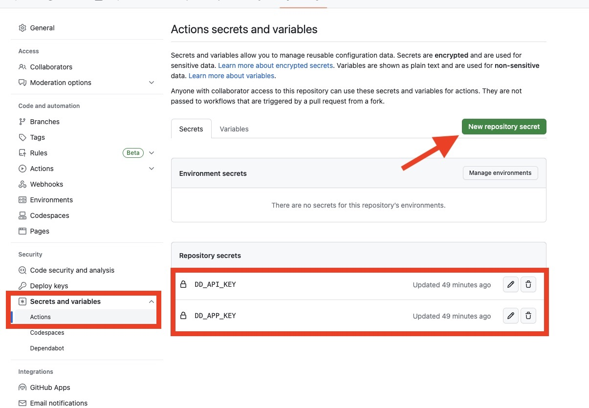

# Datadog Static Analyzer Github Action

Run a Datadog Static Analysis in your Github Action workflows.

## Preliminary

To use the Datadog static analyzer, you need to add a `static-analysis.datadog.yml` file to your repositories root directory that specifies what rulesets to use.

```yaml
rulesets:
  - <ruleset-name>
  - <ruleset-name>
```

## Workflow

Create a file in `.github/workflows` to run a Datadog static analysis.

Here's a sample workflow file.

```yaml
on: [push]

jobs:
  check-quality:
  runs-on: ubuntu-latest
  name: Datadog Static Analyzer
  steps:
    - name: Checkout
      uses: actions/checkout@v3
    - name: Check code meets quality standards
      id: datadog-static-analysis
      uses: DataDog/datadog-static-analyzer-github-action@v1.0.0
      with:
        dd_app_key: ${{ secrets.DD_APP_KEY }}
        dd_api_key: ${{ secrets.DD_API_KEY }}
        dd_service: "my-service"
        dd_env: "my-env"
        dd_site: "datadoghq.com"
```

> You **must** set your Datadog API and Application Keys as secrets in your GitHub repository. For more information, see [API and Application Keys](1)

## Inputs

| Name         | Description                                                                                                                | Required | Default         |
|--------------|----------------------------------------------------------------------------------------------------------------------------|----------|-----------------|
| `dd_api_key` | Your Datadog API key. This key is created by your [Datadog organization][1] and should be stored as a [secret][2].         | True     |                 |
| `dd_app_key` | Your Datadog Application key. This key is created by your [Datadog organization][1] and should be stored as a [secret][2]. | True     |                 |
| `dd_service` | The service you want your results tagged with.                                                                             | True     |                 |
| `dd_env`     | The environment you want your results tagged with.                                                                         | True     |                 |
| `dd_site`    | The Datadog site. For users in the EU, set to `datadoghq.eu`.                                                              | False    | `datadoghq.com` |

### Secrets Example



[1]: https://docs.datadoghq.com/account_management/api-app-keys/
[2]: https://docs.github.com/en/actions/security-guides/encrypted-secrets
